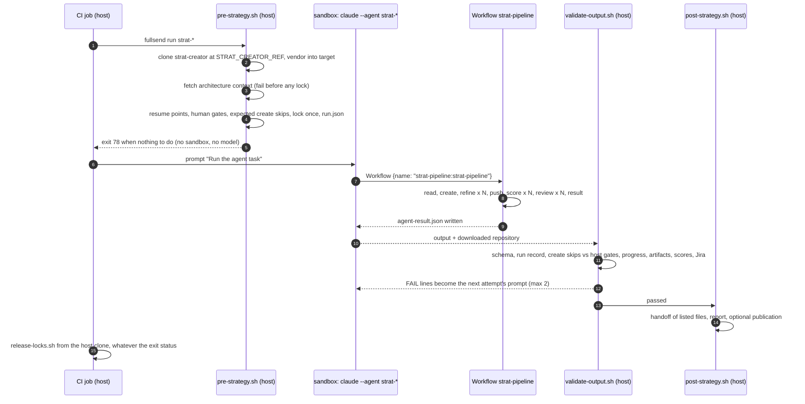

# strat-creator on fullsend

Three [fullsend](https://github.com/fullsend-ai/fullsend) agents run the
strategy pipeline (create, refine, push, review) in a sandbox. A Claude Code
Workflow script holds the sequence. The skills and Python helpers in this
repository do the work.

| Agent | Starts | Work |
|---|---|---|
| `strat-single` | `fullsend run strat-single`, with `RFE_KEY` | one approved RHAIRFE, 90 min |
| `strat-batch` | `fullsend run strat-batch` | the RHAIRFEs `scripts/list-rfe-ids.py --jql-default` finds, 295 min |
| `strat-resume` | a `/fs-strat resume` comment on a RHAISTRAT issue (CEL trigger), or `fullsend run strat-resume` with `FULLSEND_WORK_ITEM_KEY` | one STRAT, from the step the host computes, 90 min |

Requirements: fullsend v0.45.0, and Claude Code 2.1.154 or later in the
sandbox (the Workflow tool shipped in 2.1.154). The harnesses pin fullsend
v0.45.0's sandbox image, which ships Claude Code 2.1.286. Behaviour was checked
on these local Claude Code builds:

- 2.1.286: the trigger and the smoke test.
- 2.1.260, 2.1.292 and 2.1.295: `-p` waits for the workflow; a workflow agent
  has no Agent tool; a `context: fork` skill runs inside a workflow agent.
- 2.1.295: the trigger.

None of these checks ran inside a fullsend sandbox.

## How a run works



| Piece | Where it runs | What it trusts |
|---|---|---|
| `shared/pre-strategy.sh`, `prepare_run.py`, `vendor.py` | host, before the sandbox | a strat-creator clone at a verified sha |
| `plugins/strat-pipeline/workflows/strat-pipeline.js` | sandbox, as a fullsend-scanned plugin | the order of the steps |
| skills, `strat-scorer`, `scripts/strat_pipeline_state.py` | sandbox | Jira, with `JIRA_TOKEN` |
| `shared/validate-output.sh`, `validate_result.py` | host, after each attempt | reads the downloaded repository as data |
| `shared/post-strategy.sh`, `handoff.py`, `publish/` | host, after validation | copies only the regular files the validated result lists |
| `shared/release-locks.sh` | CI, after `fullsend run` | the host lock record |

The agent never locks or unlocks RFEs and never sees JQL. The sandbox can reach
Jira (opaque TLS tunnel, `shared/policy.yaml`) and the model provider, and
nothing else. It cannot reach GitHub or the results services.

The sandbox does hold `JIRA_TOKEN`, and this is a known exposure. Strategy
creation has to write to Jira (clone, link, label, push, comment), and the
repository's Python Jira client signs those requests itself, so the token
cannot stay on the runner the way rfe-creator's read-only Jira provider keeps
it. The policy limits that token to `redhat.atlassian.net:443`, called from
`python3`. The `strat-resume` trigger accepts only a human with `write`,
`maintain` or `admin` role, because the run it starts writes to Jira. The
role of a Jira commenter comes from fullsend's Jira adapter. The trigger was
evaluated with `fullsend dispatch` on the event fixtures in
`tests/fixtures/fullsend-events/`, not on a live Jira event.

## The Workflow

`plugins/strat-pipeline/workflows/strat-pipeline.js` has named steps:

1. **read**: one agent returns `tmp/strat-input.json` and `tmp/strat-progress.json` as JSON.
2. **create**: `/strategy-create` over the locked keys. It returns the RFE to STRAT map.
3. **refine**: `parallel()` runs one `/strategy-refine` per strategy.
4. **push**: one agent runs `scripts/push_refined_strategies.py`.
5. **score**: one `strat-scorer` agent per strategy, with a separate run directory for each, `/tmp/strat-assess/<KEY>`.
6. **review**: `/strategy-review <KEY> --scores-from /tmp/strat-assess/<KEY>`.
7. **result**: `scripts/strat_pipeline_state.py result` writes `agent-result.json`, then `fullsend-check-output` checks it.

A workflow has no shell of its own, so every command runs in a step agent.
Each step records its outcome in `tmp/strat-progress.json` through
`scripts/strat_pipeline_state.py`. When `agent()` returns `null` (the agent
failed or was stopped), the script records the step and key with `--failed`,
and the result is `failed`. It is never reported as completed.

Parallel steps take a file lock around each progress update, so no step's
entry is lost. A create that leaves some RFEs with neither a strategy nor a
skip stays open, and the next attempt runs `strategy-create` for those RFEs
only. A push covers the refined strategies that
`push_refined_strategies.py` pushes: status `Refined`, with a matching
`jira_key`. A strategy
refined later, by a retried create, gets a push of its own before its review,
and a refined strategy no push covers is never reviewed.

The agent cannot skip work by claiming it was skipped. Before the run,
`prepare_run.py` evaluates `strategy-create`'s gates for every locked RFE:
excluded status, release scope, quality label, and STRAT state, from
`config/pipeline-settings.yaml`. It records the outcome as `expected_skips` in
the host run record. If the host cannot evaluate the gates, nothing is locked
and the run fails. A claimed skip the host did not expect stays pending, so
the next attempt runs `strategy-create` for that RFE again. The validator rejects a claimed skip the host did not
expect, and a strategy created for an RFE the host expected to be skipped.
`strategy-create`'s "reconstruction failed" skip cannot be predicted from Jira
fields, so it always fails validation, with a line telling a human to restore
the RFE original or fix the STRAT description.

Workflow agents have no Agent tool, on every Claude Code version tested. So the
scorer that `strategy-review` would normally launch runs as a workflow agent of
its own. `--scores-from` tells the skill to use that agent's result instead of
launching another.

Concurrency is the Workflow default: min(16, CPUs - 2) agents at a time.

## Resume points and human gates

A human stop is a run boundary, not a pause inside a run. The pre-script gives
each RFE a resume point from durable state: the STRAT's Jira labels, plus the
previous run's progress record when `STRAT_PREVIOUS_PROGRESS` names one. The
first rule that matches wins:

| STRAT state | Previous progress | Result |
|---|---|---|
| no open STRAT | | `create` |
| `strat-creator-rubric-pass`, `-needs-attention` or `-human-sign-off` | | skipped, not locked (done, or waiting for a human) |
| no `strat-creator-auto-refined` | | `refine` |
| auto-refined, no verdict label | pushed, no review recorded | `review` |
| auto-refined, no verdict label | anything else (a human cleared needs-attention) | `refine` |

`create` always runs, because it is also how an existing STRAT gets into the
sandbox: `strategy-create` imports it (Path A) instead of cloning it. With the
`review` resume point, the run skips refine and push for that RFE.

A run that ends at a human gate is a success: the strategy is reported with
`needs_attention: true`, and the validator accepts it. To continue, a human
edits the STRAT, removes `strat-creator-needs-attention`, and comments
`/fs-strat resume` on the RHAISTRAT issue.

A second fullsend attempt (`validation_loop`, same sandbox) reruns the
workflow from the top. The workflow skips what `tmp/strat-progress.json`
records. Steps that run again are safe because of the skills' own idempotency:
the Path A import, and the label gates in create, refine and review.

## Verify the harnesses locally

These commands need no sandbox. All output below is real.

The harness plugin and the repository plugin validate:

```console
$ claude plugin validate .fullsend/plugins/strat-pipeline
Validating plugin manifest: .../.fullsend/plugins/strat-pipeline/.claude-plugin/plugin.json

✔ Validation passed
$ claude plugin validate .        # output trimmed to the verdict
⚠ Found 1 warning:
  ❯ root: CLAUDE.md at the plugin root is not loaded as project context. ...
✔ Validation passed with warnings
```

Every harness resolves its pinned remote dependencies:

```console
$ fullsend lock --all --fullsend-dir .fullsend
⚡ fullsend 0.45.0
→ Locking dependencies: strat-batch
  ✓ Agent strat-batch resolved from config (local path)
  ! strat-batch: warning: env.sandbox: env.sandbox coexists with host_files entry shared/gcp-vertex.env ...
  ✓ Resolved 2 dependencies
      openshell.profiles[0]: https://raw.githubusercontent.com/fullsend-ai/agents/11dd3ad15ab5033fd04661d7faf6f7af45548d2f/profiles/fullsend-vertex-ai.yaml (fetched)
      providers[0]: https://raw.githubusercontent.com/fullsend-ai/agents/11dd3ad15ab5033fd04661d7faf6f7af45548d2f/providers/vertex-ai.yaml (fetched)
...
  ✓ locked 3: strat-batch, strat-resume, strat-single
```

The resume trigger selects `strat-resume` for a human `/fs-strat resume` Jira
comment, and nothing else. The events are in `tests/fixtures/fullsend-events/`:

```console
$ fullsend dispatch --config-dir .fullsend --input-driver json --input-file tests/fixtures/fullsend-events/jira-comment-match.json --output-driver json | jq -c '[.[]? | {agent, role, event_type}]'
[{"agent":"strat-resume","role":"triage","event_type":"comment"}]
$ fullsend dispatch --config-dir .fullsend --input-driver json --input-file tests/fixtures/fullsend-events/jira-comment-other-command.json --output-driver json | jq -c '[.[]? | {agent, role, event_type}]'
[]
$ fullsend dispatch --config-dir .fullsend --input-driver json --input-file tests/fixtures/fullsend-events/jira-comment-bot.json --output-driver json | jq -c '[.[]? | {agent, role, event_type}]'
[]
```

The host side runs against the jira-emulator. Here is a `strat-single`
pre-script, then the validator and the post-script for a two-strategy run:

```console
$ uv run pytest tests/test_fullsend_host_integration.py -q -s -k "vendors_locks or consistent or post_script"
strat-single pre-script: preparing <tmp>/consumer with strat-creator 724317ec1a19
vendor: copied 322 file(s) from strat-creator 724317ec1a19 into <tmp>/consumer
strat-single pre-script: architecture context rhoai-9.9
prepare-run: locked RHAIRFE-7001:create
strat-single pre-script: complete
PASS: result matches the run record, progress, artifacts and scores
Result: action=completed mode=batch run=run-2 dry_run=False
handoff: copied 4 artifact file(s) to <tmp>/run/publish/handoff
Report generated: <tmp>/run/publish/results/reports/report.html
INFO: RESULTS_REPO_URL not set; results assembled at <tmp>/run/publish/results, nothing pushed
3 passed, 13 deselected in 4.84s
```

The Workflow runs headless under fullsend's exact launch shape (`--agent`, the
default prompt `Run the agent task`). The run uses stub create, refine and
reviewer skills and a stub rubric, but the real `strat-scorer`,
`strategy-review --scores-from --dry-run`, `parse_results.py` and
`apply_scores.py`. It needs an authenticated `claude` CLI and calls the model:

```console
$ STRAT_WORKFLOW_SMOKE=1 CLAUDE_BIN=<claude 2.1.286> uv run pytest tests/test_strat_pipeline_workflow.py -v -s
tests/test_strat_pipeline_workflow.py::test_workflow_runs_headless_under_fullsend_launch_shape
{
  "action": "completed",
  "mode": "batch",
  "summary": "2 of 2 strategies reviewed for 3 locked RFE(s); 1 skipped by strategy-create.",
  "skipped": [
    {
      "key": "RHAIRFE-9004",
      "reason": "blocked by label(s): strat-creator-needs-attention"
    },
    {
      "key": "RHAIRFE-9003",
      "reason": "missing release scope label"
    }
  ],
  "strategies": [
    {
      "rfe": "RHAIRFE-9001",
      "strat": "STRAT-9001",
      "recommendation": "revise",
      "needs_attention": true
    },
    {
      "rfe": "RHAIRFE-9002",
      "strat": "STRAT-9002",
      "recommendation": "approve",
      "needs_attention": false
    }
  ],
  "completed_phases": [
    "create",
    "refine",
    "push",
    "review"
  ],
  "dry_run": true,
  "errors": []
}
wall 438s, result events at [223, 224], workflow notice at [53, 54, 150, 158, 160, 162, 164, 166, 168, 173, 217]
PASSED
======================== 1 passed in 437.76s (0:07:17) =========================
```

`make test-workflow-smoke` runs the same test. The first tool call in that run was `Workflow {"name":"strat-pipeline:strat-pipeline"}`.
Both `result` events come after the workflow's last completion notice, so the
`--print` turn waited for the run. It used 10 workflow agents and about 203k
tokens ($3.39 on Opus list prices, main loop included). Per-step cost is about
18k tokens for a step agent and 10k for the restricted-tools scorer.

## Run it in CI

Not run in this change: the gateway available for development could not create
sandboxes. These are the steps a CI job takes. Every variable referenced in
`env.runner` must be set; an empty value is fine.

```bash
export STRAT_CREATOR_REF=<the strat-creator commit this harness is pinned to>
export STRAT_CREATOR_REPO=                       # empty: https://github.com/opendatahub-io/strat-creator.git
export STRAT_RUN_ID="${CI_JOB_ID}" STRAT_STATE_DIR="$(mktemp -d)"   # host only
export STRAT_DRY_RUN= STRAT_PREVIOUS_PROGRESS= STRAT_ARCHITECTURE_CONTEXT_PATH= STRAT_PUBLISH_DIR=
export RESULTS_REPO_URL= RESULTS_PUSH_TOKEN= RESULTS_GIT_USER= ORG_PULSE_URL= ORG_PULSE_API_TOKEN=
export RFE_KEY=RHAIRFE-1234                      # strat-single
export BATCH_SIZE=10 BATCH_OFFSET=0 BATCH_EXPECTED_KEYS=   # strat-batch
export FULLSEND_WORK_ITEM_KEY=RHAISTRAT-5678     # strat-resume (dispatch sets it)

fullsend run strat-single --fullsend-dir .fullsend --target-repo .; rc=$?
# Always, whatever $rc is: release the locks this run recorded.
release="${STRAT_STATE_DIR}/strat-creator/.fullsend/shared/release-locks.sh"
[ -f "${release}" ] && bash "${release}" "${STRAT_STATE_DIR}"
exit "${rc}"
```

`JIRA_SERVER`, `JIRA_USER`, `JIRA_TOKEN`, `GOOGLE_APPLICATION_CREDENTIALS`,
`ANTHROPIC_VERTEX_PROJECT_ID`, `CLOUD_ML_REGION` and `GOOGLE_CLOUD_PROJECT` come
from the CI secret store. `STRAT_DRY_RUN=1` writes nothing to Jira: candidates
are checked for blocking labels instead of being locked, and the skills run
with `--dry-run`. Resume points still come from Jira in a dry run. A dry-run
strategy is a local `STRAT-NNNN` with no Jira clone, so a dry run never
resumes at `review`.

If the CI job itself is lost, the locks stay. Find them with the JQL
`labels = strat-creator-processing`, and release them with
`python3 scripts/lock_issues.py unlock <keys>`.

## Install in another repository

A harness added by URL (`fullsend agent add <url>`) resolves its relative paths
against the consumer's `.fullsend/`, not against this repository. Instead,
write a thin harness that names this one as `base:`. fullsend then fetches
every relative reference, scripts included, from the same pinned tree.

```yaml
# .fullsend/strat-single.yaml in the consumer repository
base: https://raw.githubusercontent.com/opendatahub-io/strat-creator/<sha>/.fullsend/strat-single/strat-single.yaml#sha256=<sha256>
```

Set `STRAT_CREATOR_REF=<sha>`, the same commit. The pre-script clones
strat-creator at that sha on the host, checks it, and vendors these paths into
the consumer checkout before the sandbox starts:

- `.claude/skills/` (the `scripts` symlinks are dereferenced, so only regular files are copied)
- `.claude/agents/strat-scorer.md`
- `scripts/`, `config/` and `workflows/`

`artifacts/` and the progress record (`artifacts/strat-progress.json`) end up
in the consumer repository. The vendor step refuses to overwrite a file the
consumer owns, and records what it wrote in `.strat-creator-vendor.json`.

How `base:` resolution works was checked with rfe-creator's published harness:
`fullsend lock` from a consumer resolved all 12 of its dependencies from the
base URL. The strat-creator URLs exist only once this change is merged.

The repository-root plugin (`.claude-plugin/plugin.json`) is for Claude Code
and marketplace users. It ships the skills, the strat-scorer agent and the
same workflow. Because the plugin's skills and agent are namespaced, the
workflow accepts `args.namespace` (`"strat-creator:"`). That interactive path
was validated with `claude plugin validate .` only; it has not been run.

## Platform dependency

fullsend cannot yet pin a definition repository as a whole. `plugins:` refuses
a tree URL at a repository root ("URL must point to a directory inside the
repo, not the repo root") and refuses trees that contain symlinks (the
tree-contents rule in fullsend's harness reference). The vendoring step in the
pre-script stands in for that pin, and the orchestration script ships as the
small scanned plugin in `plugins/strat-pipeline`. Once fullsend can pin a
definition repository the way it pins a fleet agent, the vendoring step
collapses into one `plugins:` entry.

## Provenance

The three publication helpers in `shared/publish/` (`push-results.py`,
`push-to-org-pulse.py`, `clone-data-repo.sh`) are carried from
github.com/jctanner-opendatahub-io/strat-creator at `78ab3f1e`
(`.fullsend/scripts/ci/`, Apache-2.0). They have no other public source. Their
logic is unchanged; the only edits are the provenance comments, two
documentation examples and two lint fixes (an f-string without placeholders,
one long line). Everything else under `.fullsend/` is new.
