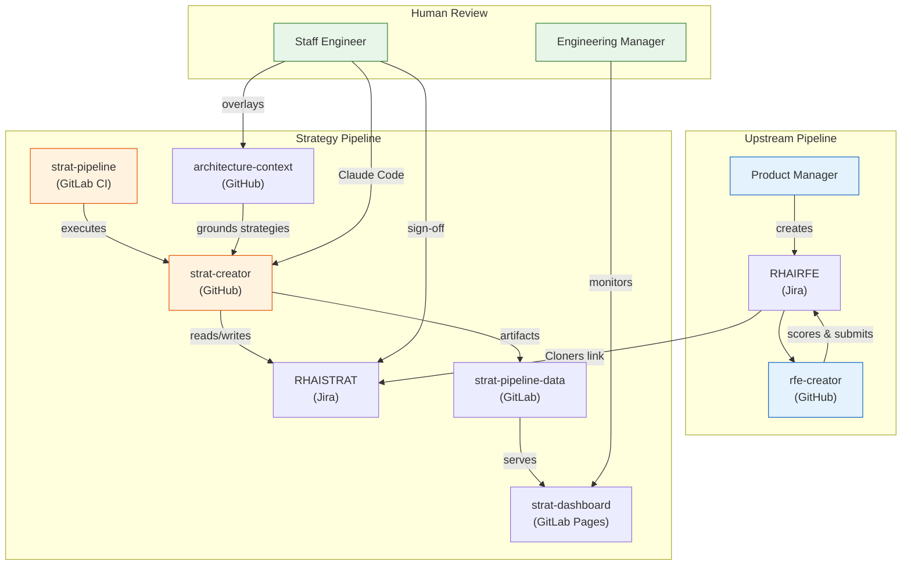

# Strat Creator

Takes approved RFEs, which describe the **WHAT and WHY**, and produces the **HOW**: actionable implementation strategies grounded in real platform architecture.

The pipeline checks technical feasibility against architecture context and scores every strategy so the team knows what's ready and what needs attention. The full lifecycle spans two pipelines (rfe-creator and strat-creator), Jira, CI automation, and human review in Claude Code.

## How It Works

```mermaid
flowchart LR
    A["RFE Idea"] --> B["RFE Creation\n(rfe-creator)"]
    B --> C["RFE Assessment\n(rfe-creator)"]
    C --> D["RFE Submission\n(rfe-creator)"]
    D --> E["Discovery &\nFiltering"]
    E --> F["Strategy\nCreation"]
    F --> G["Strategy\nRefinement"]
    G --> H["Strategy\nReview"]
    H --> I["Human Review\n& Sign-off"]
    I --> J["Feature-Ready\nStrategy"]

    style B fill:#e3f2fd,stroke:#1565c0
    style C fill:#e3f2fd,stroke:#1565c0
    style D fill:#e3f2fd,stroke:#1565c0
    style E fill:#fff3e0,stroke:#e65100
    style F fill:#fff3e0,stroke:#e65100
    style G fill:#fff3e0,stroke:#e65100
    style H fill:#fff3e0,stroke:#e65100
    style I fill:#e8f5e9,stroke:#2e7d32
    style J fill:#e8f5e9,stroke:#2e7d32
```



**Legend:** Blue = rfe-creator (upstream) | Orange = strat-creator (CI) | Green = Human workflow

## Architecture Overview



## Project Structure

```text
strat-creator/
├── scripts/                # Python/shell scripts (Jira, frontmatter, state, reports)
│   ├── frontmatter.py          # YAML frontmatter read/write/schema
│   ├── state.py                # State persistence for long-running skills
│   ├── apply_scores.py         # Apply scorer results to review frontmatter
│   ├── fetch_issue.py          # Jira REST API fallback
│   ├── jira_utils.py           # Jira API, JQL search, pre-filtering
│   ├── list-rfe-ids.py         # RFE discovery (JQL, config, batching)
│   ├── find_strat_for_rfe.py   # Deterministic STRAT lookup via Cloners links
│   ├── pull_strategy.py        # Pull RHAISTRAT from Jira into local/
│   ├── fetch-architecture-context.sh
│   ├── bootstrap-assess-strat.sh   # Clone assess-strat plugin into .context/
│   ├── generate-report.py      # Per-run HTML report
│   └── generate-dashboard.py   # Aggregate dashboard across runs
├── .claude/
│   ├── skills/                 # Claude Code skills (pipeline steps + reviewers)
│   └── agents/                 # Agent definitions (generated by bootstrap)
│       └── strat-scorer.md         # Restricted scorer agent
├── config/                 # Pipeline config and batch files
│   ├── pipeline-settings.yaml  # JQL filters, batch size, skip labels, excluded statuses
│   ├── road-to-production/     # Road-to-production batch YAML files
│   ├── engineering35-batches/  # Engineering 3.5 batch YAML files
│   ├── jen-batches/            # Jen batch files for dry runs
│   └── *.yaml                  # Individual RFE lists
├── .context/               # Fetched at runtime (gitignored)
│   ├── architecture-context/   # RHOAI platform architecture docs
│   └── assess-strat/          # Scoring rubric plugin
├── local/                  # Human review workspace (gitignored, mirrors artifacts/ structure)
│   ├── strat-tasks/            # Pulled strategy files (workflow: local)
│   ├── strat-reviews/          # Pulled/generated review files
│   └── strat-originals/        # RFE context for pulled strategies
└── artifacts/              # Pipeline output (gitignored)
    ├── strat-tasks/            # Strategy documents with YAML frontmatter
    ├── strat-reviews/          # Review files + review comments
    ├── strat-originals/        # Original RFE snapshots
    ├── strat-rubric.md         # Exported scoring rubric
    └── pipeline-report.html    # Latest HTML report
```

## Who Does What

| Role | Touchpoints | Start Here |
|------|------------|------------|
| **Product Manager** | Create RFEs in Jira, track strategy progress, review verdicts | [PM Workflow](workflow-guide/product-managers.md) |
| **Staff Engineer / Architect** | Review strategies in Claude Code, contribute overlays, sign off | [Staff Engineer Workflow](workflow-guide/staff-engineers.md) |
| **Engineering Manager** | Monitor dashboard, configure batches, triage needs-attention | [EM Workflow](workflow-guide/engineering-managers.md) |

New to the project? Start with [Getting Started](getting-started.md) to set up your environment.

## Pipeline at a Glance

| Stage | Owner | Input | Output |
|-------|-------|-------|--------|
| [RFE Creation](pipeline-stages/rfe-creation.md) | rfe-creator | Problem statement | RHAIRFE ticket |
| [RFE Assessment](pipeline-stages/rfe-assessment.md) | rfe-creator | RHAIRFE ticket | Scored, feasibility-checked RFE |
| [RFE Submission](pipeline-stages/rfe-submission.md) | rfe-creator | Passing RFE | Labeled RHAIRFE in Jira |
| [Discovery & Filtering](pipeline-stages/rfe-discovery-filtering.md) | strat-creator | Jira query | Batch of eligible RFEs |
| [Strategy Creation](pipeline-stages/strategy-creation.md) | strat-creator | RHAIRFE | RHAISTRAT stub |
| [Strategy Refinement](pipeline-stages/strategy-refinement.md) | strat-creator | RHAISTRAT stub | Full strategy with HOW |
| [Strategy Review](pipeline-stages/strategy-review.md) | strat-creator | Refined strategy | Scored + reviewed strategy |
| [Human Review](pipeline-stages/human-review-signoff.md) | Staff Engineer | Scored strategy | Feature-ready strategy |
