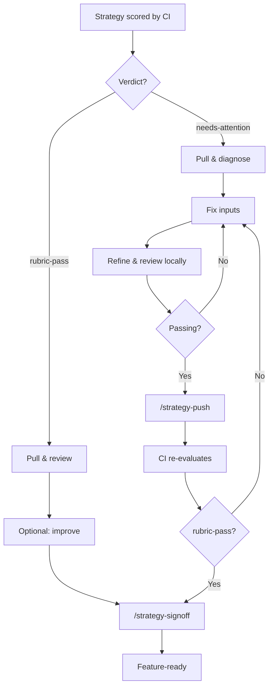
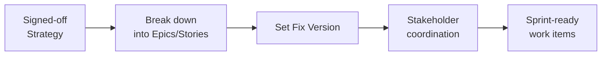

# Human Review & Sign-off

> **Owner:** Staff engineers / architects
> **Last verified:** 2026-05-21

## What Happens

Every strategy requires a human in the loop before becoming feature-ready. The path depends on CI's verdict.



## Quick Start

### Path A: Rubric-pass strategy

The strategy scored well. Review it, optionally improve, and sign off.

1. **Pull** the strategy into your local workspace:
    ```bash
    claude "/strategy-pull RHAISTRAT-NNNN"
    ```
2. **Read** the strategy file in `local/strat-tasks/` and the review in `local/strat-reviews/`. Check which dimensions scored well and what the prose reviewers flagged.
3. **If corrections are needed**, add them to the `## Staff Engineer / SME Input` section in the strategy file, then regenerate and re-score:
    ```bash
    claude "/strategy-refine RHAISTRAT-NNNN"
    claude "/strategy-review RHAISTRAT-NNNN"
    ```
4. **Sign off** once you're satisfied:
    ```bash
    claude "/strategy-signoff RHAISTRAT-NNNN"
    ```

### Path B: Needs-attention strategy

CI flagged issues. Fix the inputs, iterate locally until scores pass, then push back to CI.

1. **Pull** the strategy:
    ```bash
    claude "/strategy-pull RHAISTRAT-NNNN"
    ```
2. **Read** the review prose to understand what failed and why.
3. **Fix inputs** using one of these approaches (in priority order):

    | Fix Path | When to Use | What to Edit |
    |----------|------------|-------------|
    | **Overlay** (preferred) | Wrong deps, outdated versions, component gaps | Create overlay in local [architecture-context](https://github.com/opendatahub-io/architecture-context) checkout |
    | **Staff Engineer Input** | Issue specific to this strategy | `## Staff Engineer / SME Input` section |
    | **Contact maintainers** | Major structural changes | Reach out to architecture-context maintainers |

4. **Refine and review** locally (always refine before review):
    ```bash
    claude "/strategy-refine RHAISTRAT-NNNN"
    claude "/strategy-review RHAISTRAT-NNNN"
    ```
5. **If scores pass**, push back to CI for re-evaluation:
    ```bash
    claude "/strategy-push RHAISTRAT-NNNN"
    ```
6. **Wait for CI** to finish (see below), then sign off:
    ```bash
    claude "/strategy-signoff RHAISTRAT-NNNN"
    ```
7. **If scores still fail**, go back to step 3.

## Command Reference

| Command | Purpose |
|---------|---------|
| `/strategy-pull RHAISTRAT-NNNN` | Fetch strategy into `local/` workspace |
| `/strategy-refine RHAISTRAT-NNNN` | Regenerate strategy incorporating your input |
| `/strategy-review RHAISTRAT-NNNN` | Re-score strategy locally |
| `/strategy-push RHAISTRAT-NNNN` | Push needs-attention fixes back to Jira, resubmit to CI |
| `/strategy-signoff RHAISTRAT-NNNN` | Sign off a rubric-pass strategy as feature-ready |

## How to Know When CI Finishes

After pushing a needs-attention strategy back with `/strategy-push`, CI will re-evaluate it. To check if CI is done:

1. **Check Jira labels**: Look for `strat-creator-rubric-pass` or `strat-creator-needs-attention` on the RHAISTRAT ticket (the `strat-creator-processing` label is removed when CI finishes)
2. **Check the dashboard**: The [strat-dashboard](https://strat-dashboard-0f1209.gitlab.io/) shows the latest run status and which strategies were processed

## Dry-Run Mode

To test changes locally without writing to Jira, add `--dry-run` to refine and review commands:

```bash
claude "/strategy-refine RHAISTRAT-NNNN --dry-run"
claude "/strategy-review RHAISTRAT-NNNN --dry-run"
```

This produces all local artifacts but skips Jira writes.

## What "Feature-Ready" Means

When `/strategy-signoff` completes:

- Strategy content is pushed to Jira
- Review summary is posted as a Jira comment
- Full review file is attached to the RHAISTRAT ticket
- `strat-creator-human-sign-off` label is applied
- The strategy is ready for the post-signoff workflow below

## After Sign-off: From Strategy to Execution

Sign-off marks the end of the automated pipeline. What follows is a human-driven process to turn the strategy into plannable work.



### 1. Break Down into Epics and Stories

The staff engineer or SME breaks the RHAISTRAT into Epics and Stories in Jira. Who does this is case by case: sometimes the staff engineer, sometimes the domain SME.

Each Epic should link back to the source RHAISTRAT so traceability is preserved. The strategy document provides the technical approach, dependencies, and NFRs that inform the breakdown.

!!! example
    See [RHAISTRAT-1758](https://redhat.atlassian.net/browse/RHAISTRAT-1758) for an example of a strategy broken down into implementation Epics.

### 2. Set Fix Version

Once the breakdown is done, set the **Fix Version** on the RHAISTRAT ticket to indicate which release the strategy will ship in. PMs set the Target Version (the ask), staff engineers set the Fix Version (the commitment).

### 3. Coordinate with Stakeholders

The staff engineer or SME reaches out to docs, UX, and other stakeholders to discuss:

- Whether they need to be involved
- Whether they can commit resources
- Whether they need linked Jira tickets for their work

There are no formal refinement meetings. Coordination happens directly between the people involved. If stakeholders commit, create linked Jira tickets so their work is tracked.

### 4. Use Jira as Source of Truth

All decisions, breakdowns, and commitments should be recorded in Jira. Separate refinement documents are not required. The RHAISTRAT ticket, its linked Epics/Stories, and Jira comments are the canonical record of what was decided and why.
