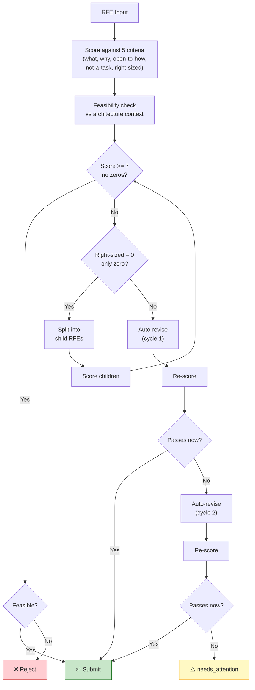

# RFE Assessment

> **Owner:** rfe-creator pipeline
> **Last verified:** 2026-05-21

## What Happens

The rfe-creator pipeline evaluates each RFE on two axes: quality and feasibility.

### Quality Scoring

RFEs are scored against 5 criteria (each 0-2, max total 10):

| Criterion | What It Checks |
|-----------|---------------|
| **What** | Is the problem clearly stated? |
| **Why** | Is there a business justification? |
| **Open to How** | Does it avoid prescribing architecture? |
| **Not a Task** | Is it framed as an outcome, not an activity? |
| **Right Sized** | Is the scope appropriate for a single feature? |

**Pass threshold:** Score >= 7 with no zero scores.

### Feasibility Check

The pipeline checks the RFE against the RHOAI architecture context to determine if it's technically viable:

- **Feasible**: Aligns with platform architecture
- **Infeasible**: Technical blockers exist
- **Indeterminate**: Needs more analysis

### Recommendations

Based on scores and feasibility, rfe-creator produces one of four recommendations:

| Recommendation | Condition | Next Action |
|---------------|-----------|-------------|
| **Submit** | Score >= 7, all non-zero, feasible | Ready for Jira submission |
| **Revise** | Score < 7 or has zeros | Auto-revision loop (up to 2 cycles) |
| **Split** | Right-sized = 0, no other zeros, feasible | Decompose into smaller RFEs |
| **Reject** | Fundamentally infeasible | Archived |

### Auto-Revision

If an RFE scores below threshold, rfe-creator attempts up to 2 revision cycles:

1. Identifies specific issues (unclear problem, missing justification, etc.)
2. Generates revised RFE text
3. Re-scores against the rubric
4. If it passes, moves to Submit. If it still fails after 2 cycles, gets `needs_attention: true`.

### Split Decision

If an RFE is too large (right-sized = 0), rfe-creator decomposes it into child RFEs. The original is archived with `rfe-creator-split-original`, and children get `rfe-creator-split-result`.

## What It Produces

- Updated RFE with scores in frontmatter
- A recommendation: submit, revise, split, or reject
- A feasibility assessment

## Next Stage

[RFE Submission](rfe-submission.md): RFEs with a "submit" recommendation are pushed to Jira.
