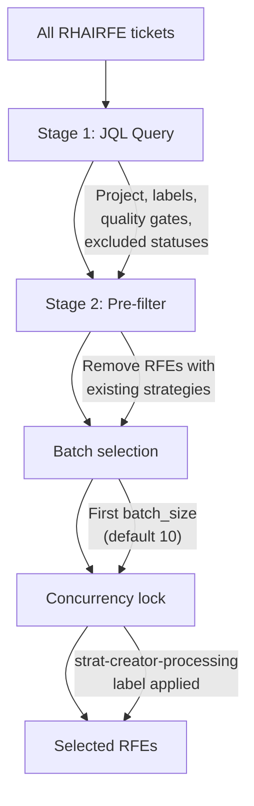

# RFE Discovery & Filtering

> **Owner:** strat-creator pipeline
> **Last verified:** 2026-05-21

## What Happens

Before any strategies are created, the pipeline needs to determine which RFEs to process. This stage queries Jira, filters out already-processed RFEs, handles concurrency locking, and selects a batch.

## Two Modes

### JQL Mode (default)

Queries Jira using filters from `config/pipeline-settings.yaml`:

```bash
python3 scripts/list-rfe-ids.py --jql-default
```

### Config File Mode

Reads RFE IDs from a manually curated YAML batch file:

```bash
python3 scripts/list-rfe-ids.py --config config/engineering35-batches/batch-01.yaml
```

## Two-Stage Filtering (JQL Mode)



### Stage 1: JQL Query (Jira-side)

The query requires:

- Project: `RHAIRFE`
- **Release scope label**: `strat-creator-3.5` OR matching Target Version (`rhoai-3.5`, `rhoai-3.5.EA1`, `rhoai-3.5.EA2`)
- Quality gate: `rfe-creator-autofix-rubric-pass` OR `tech-reviewed`
- Status NOT in: `Closed`, `Resolved`, `Draft`
- Ordered by `key ASC` for deterministic batching

!!! note "Release scope is configurable"
    The `strat-creator-3.5` label and Target Version values are not hardcoded. They are configured in [`config/pipeline-settings.yaml`](https://github.com/opendatahub-io/strat-creator/blob/main/config/pipeline-settings.yaml) and updated each release cycle (e.g., `strat-creator-3.6` for the next release). The pipeline itself is release-agnostic: only the config values change between releases.

### Stage 2: Pre-filter (before batching)

Queries RHAISTRAT to find RFEs that already have processed or active strategies (via Cloners links), then removes them. An RFE is excluded if any of its STRATs:

- Have a skip label: `strat-creator-rubric-pass`, `strat-creator-needs-attention`, or `strat-creator-processing`
- Are in an active/completed status: `In Progress`, `Review`, `Release Pending`, `Closed`, `Resolved`

### Batch Selection

After both stages, the first `batch_size` (default 10) remaining RFEs are selected. Adjust with:

```bash
python3 scripts/list-rfe-ids.py --jql-default --batch-size 20
python3 scripts/list-rfe-ids.py --jql-default --batch-size 10 --batch-offset 10
```

## Concurrency Locking

Before processing begins, `scripts/lock_issues.py` applies the `strat-creator-processing` label to each selected RFE. This prevents two pipeline jobs from processing the same RFE simultaneously.

- **Lock**: Applied at the start of processing
- **Unlock**: Removed when processing completes (or on crash recovery)
- **Stuck locks**: If a pipeline job crashes, the label may remain. See [Troubleshooting](../reference/troubleshooting.md) for manual unlock instructions.

## Known Pre-Filter Gaps

The pre-filter is conservative but not perfectly aligned with skill-level gates:

| Scenario | Pre-filter | Skill | Impact |
|----------|-----------|-------|--------|
| Multiple open STRATs (both New) | Passes | Skips | Wastes a batch slot (rare) |
| Mixed-status STRATs (one Closed + one New) | Excludes | Would import New one | Under-processes (safe direction) |
| Just-created STRAT, not yet refined | Passes | Re-imports (idempotent) | Only if pipeline crashes mid-run |

Use `--include-processed` to bypass pre-filtering when needed.

## Configuration

Most filter parameters are in [`config/pipeline-settings.yaml`](https://github.com/opendatahub-io/strat-creator/blob/main/config/pipeline-settings.yaml). Some lock/gating labels (`PROCESSING_LABEL`, `BLOCKING_LABELS`, `STRAT_REQUIRED_LABEL`, `STRAT_BLOCKING_LABELS`) are constants in `scripts/lock_issues.py`.

## Next Stage

[Strategy Creation](strategy-creation.md): Each selected RFE gets cloned into a RHAISTRAT ticket.
