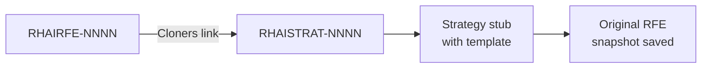

# Strategy Creation

> **Owner:** strat-creator CI pipeline
> **Last verified:** 2026-05-21

## What Happens

For each selected RFE, the `strategy-create` skill clones the RHAIRFE ticket into a new RHAISTRAT ticket and generates an initial strategy stub.

### What It Does

1. **Checks gates**: Skips RFEs that already have a RHAISTRAT with `strat-creator-auto-created`, `strat-creator-rubric-pass`, or `strat-creator-needs-attention`
2. **Clones the RFE**: Creates a new Feature in the RHAISTRAT project, linked to the source RHAIRFE via a Cloners link
3. **Generates a template**: Applies a size-based template (S/M/L/XL) with placeholder sections for the strategy
4. **Saves the original**: Stores a snapshot of the RFE at `artifacts/strat-originals/RHAIRFE-NNNN.md` for reference

### Labels Applied

- `strat-creator-auto-created` on the new RHAISTRAT ticket

### File Naming

- **Pre-submission (local only)**: `STRAT-NNN.md`
- **After Jira creation**: `RHAISTRAT-NNNN.md`

## What Triggers This Stage

- An RFE passes through [Discovery & Filtering](rfe-discovery-filtering.md)

## What It Produces

- A RHAISTRAT ticket in Jira linked to the source RHAIRFE
- `artifacts/strat-tasks/RHAISTRAT-NNNN.md`: Strategy stub with template
- `artifacts/strat-originals/RHAIRFE-NNNN.md`: RFE snapshot

## Next Stage

[Strategy Refinement](strategy-refinement.md): The stub is fleshed out with technical approach, dependencies, and NFRs.
