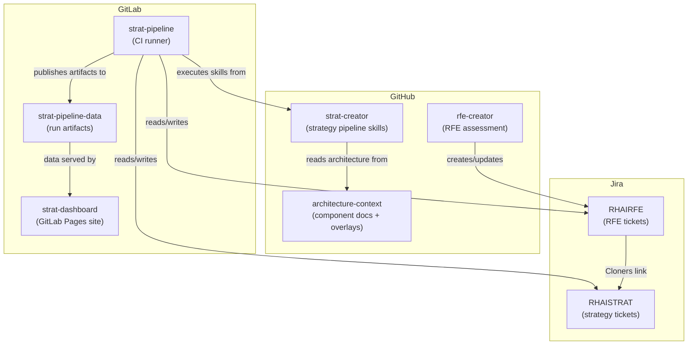
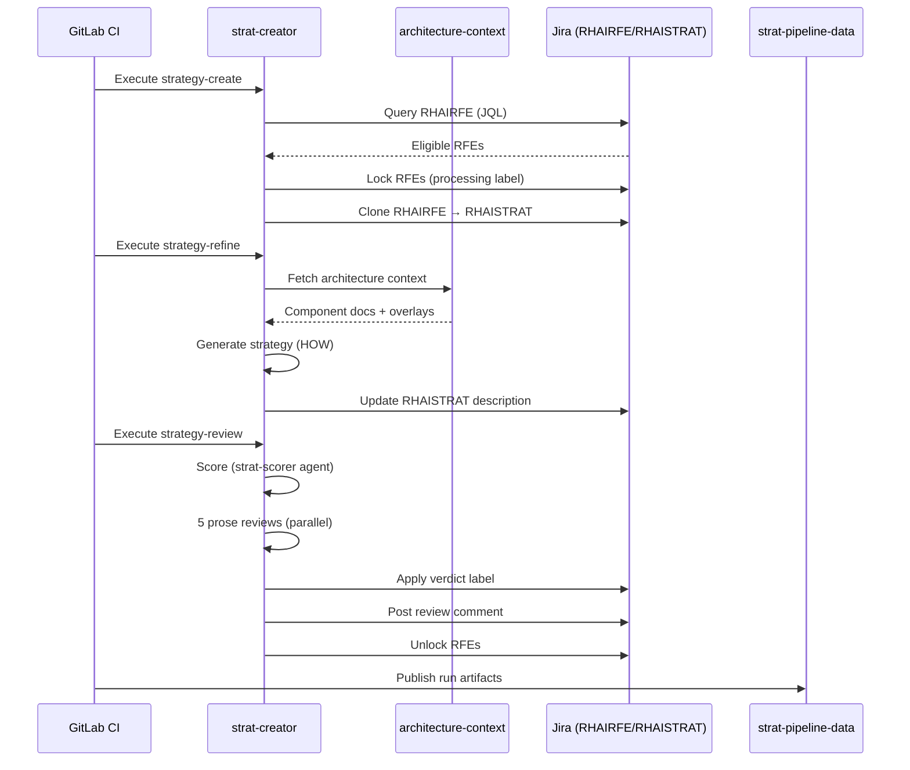

# System Architecture

The strategy pipeline spans multiple repositories across GitHub and GitLab.

## Repository Roles

| Repository | Platform | Role |
|-----------|----------|------|
| [rfe-creator](https://github.com/opendatahub-io/rfe-creator) | GitHub | Upstream RFE assessment pipeline. Creates and scores RFEs. |
| **strat-creator** | GitHub | Strategy pipeline skills, scripts, and configuration. This repo. |
| [architecture-context](https://github.com/opendatahub-io/architecture-context) | GitHub | Component docs and overlays used to ground strategies in real architecture. |
| strat-pipeline | GitLab | CI runner that executes strat-creator skills in sequence. |
| strat-pipeline-data | GitLab | Data repo with timestamped artifacts from each pipeline run (JSON, reports). |
| strat-dashboard | GitLab | GitLab Pages site serving the dashboard UI and JSON API. |

## Data Flow

1. **rfe-creator** creates/updates RHAIRFE tickets in Jira
2. **strat-pipeline** (GitLab CI) invokes strat-creator skills to process RFEs into strategies
3. **strat-creator** reads architecture context from GitHub, reads/writes Jira tickets
4. **strat-pipeline** publishes run artifacts to **strat-pipeline-data**
5. **strat-dashboard** serves the data from strat-pipeline-data as a static site

## Pipeline Execution Sequence

## Where to Look When Troubleshooting

| Problem | Check |
|---------|-------|
| Strategy not being picked up | strat-creator: `config/pipeline-settings.yaml`, pre-filter logic |
| CI job failed mid-run | strat-pipeline: GitLab CI logs |
| Dashboard showing stale data | strat-pipeline-data: check latest commit timestamp |
| Wrong architecture data | architecture-context: check overlays and base component docs |
| Jira ticket has wrong labels | strat-creator: check skill gates and label application logic |
