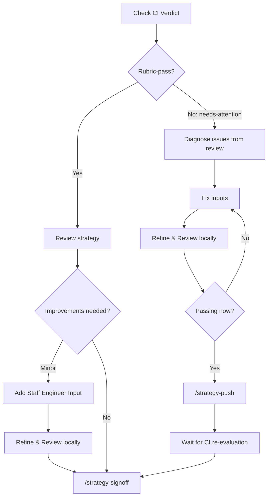

# Workflow Guide: Staff Engineers & Architects

You review strategies after CI processing, fix issues, contribute architecture overlays, and sign off strategies as feature-ready.

## Your Role in the Pipeline

You're the human in the loop. CI produces strategies and scores them, but every strategy needs a staff engineer or architect to review it before it becomes a feature. You work in Claude Code using the `local/` workspace, which is isolated from CI.

## Prerequisites

Complete the [Getting Started](../getting-started.md) setup before proceeding.

## Step 1: Find Strategies to Review

There is no automated assignment of strategies to staff engineers. You need to find strategies that are relevant to your domain and claim them.

**How to find strategies that need review:**

1. Search for unreviewed strategies in your area using JQL:
    ```text
    project = RHAISTRAT
    AND (labels = "strat-creator-rubric-pass" OR labels = "strat-creator-needs-attention")
    AND labels != "strat-creator-human-sign-off"
    AND assignee is EMPTY
    ```
2. Check the [dashboard](https://strat-dashboard-0f1209.gitlab.io/) for an overview of pending strategies and their scores
3. Look at the linked RHAIRFE to understand which component area the strategy covers

**Claiming a strategy:** Assign the RHAISTRAT ticket to yourself in Jira so other staff engineers know you're working on it. There's no formal routing today. Pick strategies that match the components you know best.

## Step 2: Pull the Strategy

```bash
claude "/strategy-pull RHAISTRAT-NNNN"
```

This fetches into `local/` (gitignored, isolated from CI):

- `local/strat-tasks/RHAISTRAT-NNNN.md`: the strategy document
- `local/strat-originals/RHAIRFE-NNNN.md`: the original RFE
- `local/strat-reviews/RHAISTRAT-NNNN-review.md`: the CI review with scores and prose

## Step 3: Read the Strategy and Review

Open the strategy file. It has three sections:

- **Top section**: Verbatim copy of the original RFE (the business need)
- **Strategy (AI Generated)**: The AI-generated technical approach
- **Staff Engineer / SME Input**: Where you add corrections and guidance

Check the review file for scores and prose feedback. The score table shows which dimensions failed, and the prose reviews explain what each reviewer flagged.

## Step 4: Choose Your Path



### Path A: Rubric-Pass

The strategy scored well. Review it, optionally improve it, and sign off:

1. Read the strategy and review prose
2. If you have corrections, add them to `## Staff Engineer / SME Input`
3. Rerun locally to incorporate your input:
   ```bash
   claude "/strategy-refine RHAISTRAT-NNNN"
   claude "/strategy-review RHAISTRAT-NNNN"
   ```
4. Sign off:
   ```bash
   claude "/strategy-signoff RHAISTRAT-NNNN"
   ```

### Path B: Needs-Attention

CI flagged issues. Fix the inputs, resubmit, then sign off after CI approves:

1. Read the review prose to understand what failed
2. Fix inputs using one of these approaches (in priority order):

    | Fix Path | When to Use | What to Edit |
    |----------|------------|-------------|
    | **Overlay** (preferred) | Wrong deps, outdated versions, component gaps | Create overlay in local [architecture-context](https://github.com/opendatahub-io/architecture-context) checkout |
    | **Staff Engineer Input** | Issue specific to this strategy | `## Staff Engineer / SME Input` section |
    | **Contact maintainers** | Major structural changes | Reach out to architecture-context maintainers |

3. Rerun locally (always refine before review):
   ```bash
   claude "/strategy-refine RHAISTRAT-NNNN"
   claude "/strategy-review RHAISTRAT-NNNN"
   ```
4. When scores pass locally, push back to CI:
   ```bash
   claude "/strategy-push RHAISTRAT-NNNN"
   ```
5. Wait for CI to re-evaluate. Check the RHAISTRAT ticket for `strat-creator-rubric-pass` label, or check the dashboard for the latest run status.
6. Once CI approves, sign off:
   ```bash
   claude "/strategy-signoff RHAISTRAT-NNNN"
   ```

## Testing Overlays Locally

If you're contributing an architecture overlay, test it before pushing:

```bash
claude "/strategy-refine RHAISTRAT-NNNN --architecture-context /path/to/local/architecture-context"
claude "/strategy-review RHAISTRAT-NNNN --architecture-context /path/to/local/architecture-context"
```

After confirming the overlay fixes the issue, submit a PR to [opendatahub-io/architecture-context](https://github.com/opendatahub-io/architecture-context).

## After Sign-off

Once a strategy is signed off, the automated pipeline is done. You then break the strategy down into Epics/Stories, set the Fix Version, and coordinate with stakeholders (docs, UX). See [After Sign-off: From Strategy to Execution](../pipeline-stages/human-review-signoff.md#after-sign-off-from-strategy-to-execution) for the full post-signoff workflow.

## Key Rules

1. **Edit inputs, not outputs.** The strategy text is regenerated by refine. Direct edits get overwritten.
2. **Prefer overlays over one-off fixes.** They benefit all future strategies.
3. **Always refine before review.** Review scores what refine produces.
4. **Needs-attention must go back through CI.** Use `/strategy-push`, then `/strategy-signoff` after CI approves.
5. **Sign-off requires CI approval.** The `strat-creator-human-sign-off` label requires `strat-creator-rubric-pass`.
